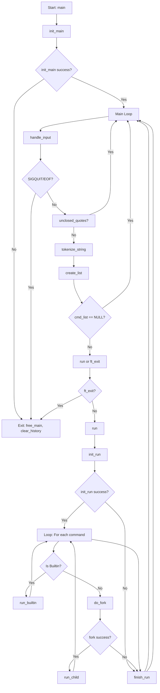

# **Minishell**  
*"As beautiful as a shell"*  

created by - [Anttoni](https://github.com/manttoni) and [Mark](https://github.com/607mark)  

---
## **🧩 What Problem Does This Minishell Solve?**
This minishell reimplements core shell behavior - parsing, tokenization, process forking, I/O redirection, and signal handling - using only low-level C functions. It addresses the challenge of managing child processes, handling edge cases like unclosed quotes or Ctrl+D, and executing built-in commands without relying on standard shell utilities.


## **Overview**  
Minishell is a simple, lightweight Unix shell built from scratch. It replicates the basic functionality of Bash, offering:  
- Command execution  
- Environment variable management
- Piping
- Input/output redirection  
- Heredoc support  
- Graceful signal handling
- Robust error handling

### **Installation**  
Clone the repository:  
```bash
git clone git@github.com:607mark/minishell.git
cd minishell
make
```

Run the shell:  
```bash
./minishell
```

---

## **Features**  

- **Tokenizer**: Input is tokenized gracefully, breaking it down into manageable pieces for seamless parsing and execution, even for complex commands
- **Commands**: Minishell can execute any command that is located in the directories specified in your $PATH
- **Pipes**: Combine commands using `|`
- **Env varibles**: Expands $VARNAME to a string that is stored in env. you can add and remove them with export, unset
- **Redirections**: Input (`<`), Output (`>`), Append (`>>`), Heredoc (`<<`)  
- **Exit Codes (`$?`)**:  
  - Returns accurate exit codes for commands/executables, maintaining Bash-like behavior.  
  - Captures the correct exit status in pipelines (`$?` reflects the last command in the pipeline).  
  - Detects signals and handles exit codes accordingly.
- **Signals**:  replicates the functionality of Bash
  - ctrl-C
  - ctrl-D
  - ctrl-\

## **Execution Flow Diagrahm**



## **Testing and Debugging**  

Minishell comes with built-in tools for testing and debugging to ensure reliability and detect memory issues.  

### **Memory Leak Testing with Valgrind**  
The `valrun.sh` script allows you to run Minishell with Valgrind to detect memory leaks and other issues.  

#### **Usage**  
```bash
./valrun.sh
``` 
- **Suppressions file**: `supp.supp` ensures that false positives or irrelevant warnings are filtered out for cleaner output.  

---

### **Automated Testing with Tester**  
The `/tester/` directory includes `tester.sh`, a script that runs over 150 test cases to verify Minishell's functionality.  

#### **Usage**  
```bash
cd tester
./tester.sh
```  
## **Built-in Commands**  

Minishell implements the following built-in commands, mimicking their behavior in Bash:  

| **Command** | **Description** | **Example** |  
|-------------|-----------------|-------------|  
| `echo`      | Prints text to the terminal. Supports the `-n` option to omit the trailing newline. | `echo -n "Hello, World!"` |  
| `cd`        | Changes the current directory. Accepts relative or absolute paths. | `cd /home/user` |  
| `pwd`       | Prints the current working directory. No options are supported. | `pwd` |  
| `export`    | Sets environment variables. No options are supported. | `export VAR=value` |  
| `unset`     | Removes environment variables. No options are supported. | `unset VAR` |  
| `env`       | Displays all environment variables. No arguments or options are supported. | `env` |  
| `exit`      | Exits the shell with an optional status code. | `exit 0` |  


### **Usage**  

Example:  
```bash
echo "Hello, World!" | grep "World" > output.txt
```

### **Environment Variables**  
```bash
export VAR=value
echo $VAR
```

### **Heredoc Example**  
```bash
cat << EOF
This is a heredoc example.
EOF
```
---
